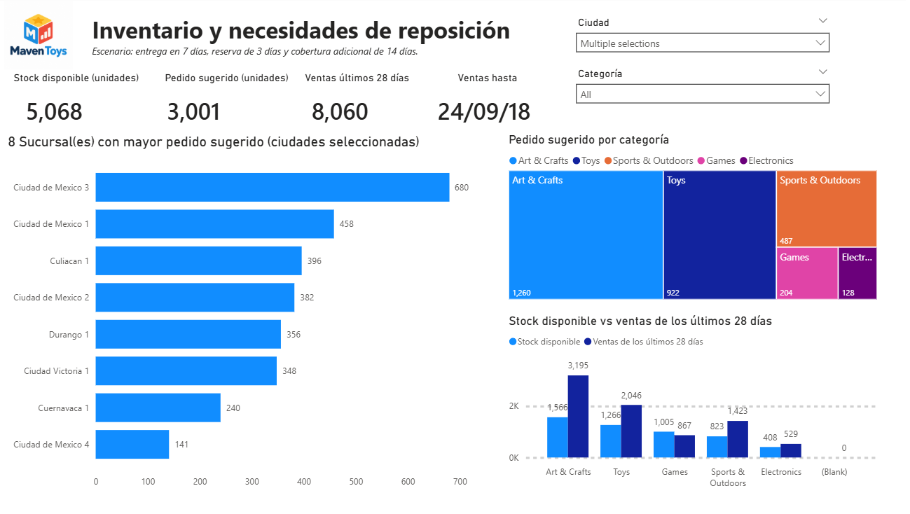

# 📦 Maven Toys — Inventory & Replenishment Analysis

Power BI project focused on solving a simple retail question:

> **What products should be replenished, in which stores, and how many units should be ordered?**

## 🎯 The Problem

Maven Toys had sales, product, store and inventory data, but it was not easy to see where stock shortages could occur.

I built a Power BI solution that transforms this information into replenishment recommendations.

The workflow was:

**Sales files → Power Query → Data Model → DAX → Replenishment Dashboard**

Using recent sales and current stock, the report estimates:

- Average daily demand
- Inventory coverage
- Reorder point
- Target stock
- Suggested order quantity

The scenario assumes **7 days of delivery time, 3 days of safety reserve and 14 additional days of coverage**.

## 📊 Dashboard Overview

The main dashboard shows where inventory pressure is concentrated and which stores require the largest replenishment orders.

## 🚨 Replenishment Center

Products are prioritized according to their inventory situation:

**Out of stock → Urgent → Replenish**

## 🔎 Product Detail

Users can drill through to a specific product and store to understand why a replenishment order is being recommended.

## 🧩 Data Model

The analysis connects sales and inventory with product and store information.

## 🔄 Data Workflow

**CSV Files → Power Query → Data Cleaning → Data Model → DAX → Power BI**

New sales files can be incorporated into the reporting workflow and refreshed without rebuilding the analysis manually.

## Tools

**Power BI · Power Query · DAX · Data Modeling · Excel/CSV**

## Power BI File

`Maven_Toys_Inventory_Analysis.pbix`

---

### About

Portfolio project based on the Maven Toys dataset, created to demonstrate how raw operational data can be transformed into a practical inventory decision tool.
