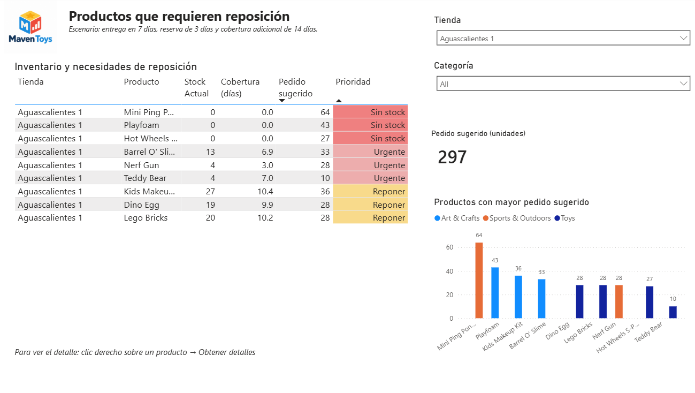
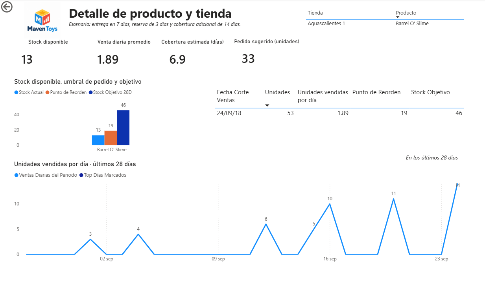

# 📦 Maven Toys — Inventory & Replenishment Analysis

Power BI project designed to answer a simple retail question:

> **What products should be replenished, in which stores, and how many units should be ordered?**

## 🎯 Business Problem

In this portfolio scenario, sales, product, store and inventory data were available, but it was difficult to quickly identify **where stock shortages could occur and what should be replenished first**.

I built a Power BI solution that converts this data into inventory and replenishment recommendations.

**Sales Files → Power Query → Data Model → DAX → Dashboard**

The analysis uses recent sales and current stock to estimate:

- Average daily demand
- Inventory coverage
- Reorder point
- Target stock
- Suggested order quantity

The scenario assumes **7 days of delivery time, 3 days of safety reserve and 14 additional days of coverage**.

## 🚨 Replenishment Priorities

Products are prioritized according to their inventory situation:

**Out of Stock → Urgent → Replenish**

This allows users to identify which products require attention and the suggested quantity to order.

## 🔎 Product Detail

Users can drill through to a specific product and store to understand **why a replenishment order is being recommended**.

The detail view compares current stock, recent demand, coverage, reorder point and target stock.

## 🔄 Data Preparation

Sales files were consolidated and cleaned using **Power Query** and connected with product, store and inventory information in Power BI.

The workflow allows new sales files to be incorporated through a refresh instead of rebuilding the analysis manually.

## 🛠️ Tools

**Power BI · Power Query · DAX · Data Modeling · Excel/CSV**

## 📁 Power BI File

`Maven_Toys_Inventory_Analysis.pbix`

---

### About

Portfolio project based on the **Maven Toys dataset**, focused on transforming operational data into a practical inventory decision tool.

---

### About

Portfolio project based on the Maven Toys dataset, created to demonstrate how raw operational data can be transformed into a practical inventory decision tool.
